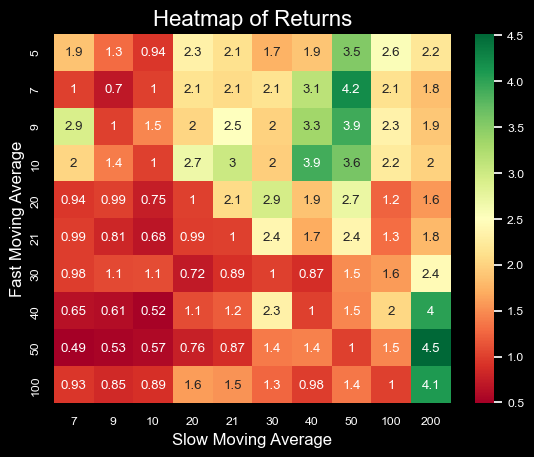
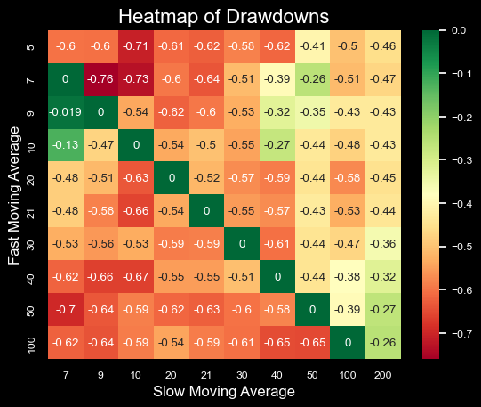

# Estrategia de cruce de medias simples: ¿Qué medias móviles usar?

[Check english version there](https://medium.com/@facujallia/maximizing-profitability-of-moving-average-crossover-trading-strategy-what-moving-averages-to-use-e5cd70085690)

El cruce de medias o  Moving Average Crossover es una de las estrategias mas basicas en trading, ademas es un buen punto de partida de muchas estrategias mas complejas.  Utiliza dos promedios móviles para predecir las tendencias del mercado y los puntos de entrada/salida.

Para implementar esta estrategia, primero calculamos los promedios móviles a corto y largo plazo del precio de un valor. Estos promedios móviles pueden tener diferentes longitudes y están diseñados matemáticamente para tener diferentes variaciones y tasas de dirección. Cuando los dos promedios móviles se cruzan, es una señal para comprar o vender el valor.

El enfoque técnico de esta estrategia sugiere que cuando la media móvil a corto plazo (STMA por sus siglas en ingles) cruza por encima de la media móvil a largo plazo (LTMA por sus siglas en ingles), es una señal para comprar o ir en largo. Por el contrario, cuando el STMA cruza por debajo del LTMA, es una señal para vender. Este enfoque se basa en el principio del momentum, que establece que un precio que sube o baja en el período t probablemente continúe moviéndose en la misma dirección en el período t+1.

En este notebook, discutiremos cómo maximizar la rentabilidad con estrategias de cruce de medias móviles explorando diferentes combinaciones de STMA y LTMA. Al elegir longitudes de medias móviles correctas, es posible optimizar la estrategia y mejorar las posibilidades de éxito.

Para un primer ejemplo, analizamos 10 años del historial de precios diarios de ARKK, el ticker de ARK Innovation ETF. Utilizando una commbinación de STMA:10 y LTMA:20 obtenemos los siguientes resultados:

+ Rendimiento acumulado de la estrategia: 269,075%
+ Drawdown de la estrategia: -53,64%

Pero, ¿y si cambiamos STMA a 20 y STMA a 40? ¿O STMA a 9 y STMA a 21? Teniendo en cuenta que los MA más comunes son 5, 7, 9, 10, 20, 21, 30, 40, 50, 100 y 200, podemos analizar los rendimientos y las pérdidas de diferentes MA combinados.

# Matriz retornos con distintas Medias Moviles

Como podemos ver en el gráfico anterior, las estrategias con diferentes combinaciones de medias móviles pueden lograr rendimientos desiguales.
Las 2 mejores combinaciones para el período analizado son:
+ STMA:50, LTMA:200 con una rentabilidad acumulada de 4,5 (451,48 %)
+ STMA:7, LTMA:50 con una rentabilidad acumulada de 4,2 (421,29 %)

200, 50 y 40 parecen ser buenas opciones para elegir como LTMA para este valor pero no está demasiado claro elegir un buen candidato para STMA.

Complementariamente, podemos analizar los drawdowns para diferentes combinaciones de medias móviles como hicimos con los rendimientos.

# Matriz de drawdowns con diferentes medias móviles

Nuevamente, vemos métricas positivas en estrategias que funcionan con 40 y 200 LTMA para este activo. Por otro lado, la matriz presenta altas reducciones para números rápidos como STMA:5//LTMA:10 o STMA:7//LTMA:9.

# Pensamientos finales

A través del estudio realizado se puede observar cómo la elección de diferentes medias móviles puede afectar a los resultados de la estrategia. Sin embargo, se debe tener mucho cuidado al parametrizar posibles estrategias, ya que el estudio muestra resultados sobre cotizaciones pasadas (ver in-sample vs out-of-sample para más información).

Además, es muy importante tener en cuenta que para aplicar esta estrategia en un entorno real, se deben sumar al análisis las comisiones, así como el efecto de deslizamiento. Esto probablemente reduce el rendimiento de las estrategias, pero sería posible agregar otras reglas, como invertir a una tasa libre de riesgo cuando no se opera, vender en corto cuando se observa una señal de venta, etc.

