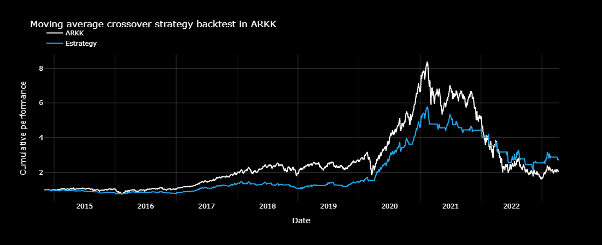

# Estrategia de cruce de medias simples: ¿Qué medias móviles usar?

El cruce de medias o  Moving Average Crossover es una de las estrategias mas basicas en trading, ademas es un buen punto de partida de muchas estrategias mas complejas.  Utiliza dos promedios móviles para predecir las tendencias del mercado y los puntos de entrada/salida.

Para implementar esta estrategia, primero calculamos los promedios móviles a corto y largo plazo del precio de un valor. Estos promedios móviles pueden tener diferentes longitudes y están diseñados matemáticamente para tener diferentes variaciones y tasas de dirección. Cuando los dos promedios móviles se cruzan, es una señal para comprar o vender el valor.

El enfoque técnico de esta estrategia sugiere que cuando la media móvil a corto plazo (STMA por sus siglas en ingles) cruza por encima de la media móvil a largo plazo (LTMA por sus siglas en ingles), es una señal para comprar o ir en largo. Por el contrario, cuando el STMA cruza por debajo del LTMA, es una señal para vender. Este enfoque se basa en el principio del momentum, que establece que un precio que sube o baja en el período t probablemente continúe moviéndose en la misma dirección en el período t+1.

En este notebook, discutiremos cómo maximizar la rentabilidad con estrategias de cruce de medias móviles explorando diferentes combinaciones de STMA y LTMA. Al elegir longitudes de medias móviles correctas, es posible optimizar la estrategia y mejorar las posibilidades de éxito.

Para un primer ejemplo, analizamos 10 años del historial de precios diarios de ARKK, el ticker de ARK Innovation ETF. Utilizando una commbinación de STMA:10 y LTMA:20 obtenemos los siguientes resultados:

+ Rendimiento acumulado de la estrategia: 269,075%
+ Drawdown de la estrategia: -53,64%

